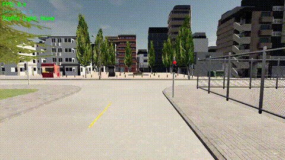

# CARLA Traffic Sign Detection using YOLO

## Overview

This project integrates a custom-trained YOLO object detection model with the CARLA simulator to perform real-time traffic sign detection and traffic light awareness.

The system:

- Spawns an autonomous vehicle in CARLA.
- Attaches an RGB camera and semantic segmentation camera.
- Runs inference using a custom YOLO model.
- Detects:
  - Pedestrians
  - Stop signs
  - Speed limit signs
- Displays the current traffic light state.
- Records annotated simulation videos.

---

## Features

- Real-time object detection using YOLO
- CARLA synchronous simulation mode
- Automatic vehicle spawning
- Traffic Manager integration
- Traffic light state monitoring
- Video recording and snapshot support
- Support for multiple CARLA towns

---

## Detected Classes

- Pedestrian
- Stop
- Speed Limit 

---

## Project Structure

```text
.
├── main.py
├── spawn_vec_cam.py
├── Weights/
│   └── best.pt
├── output_town01.mp4
├── output_town02.mp4
├── output_town01.gif
├── output_town02.gif
└── README.md
```

---

## Model Training

The YOLO model was trained on **Google Colab** using the Ultralytics YOLO framework.

### Training Pipeline

1. Dataset preparation and annotation
2. Upload dataset to Google Drive
3. Train YOLO model on Google Colab GPU
4. Export the best model weights (`best.pt`)
5. Use exported weights inside CARLA for real-time inference

Training notebook:

```text
traffic_sign_det.ipynb
```

---

## Requirements

### CARLA

Tested with CARLA 0.9.x

### Python Packages

```bash
pip install ultralytics
pip install opencv-python
pip install numpy
```

Install the CARLA Python API according to your CARLA version.

---

## Running the Project

Start the CARLA server:

```bash
./CarlaUE4.sh -quality-level=Low -fps=30

```

Run the detection script:

```bash
python3 main.py
```

---

## Configuration

Inside `main.py`:

```python
WEIGHTS = "Weights/best.pt"
HOST = "localhost"
PORT = 2000
TOWN = "Town02" or "Town01"
VEHICLE = "vehicle.tesla.model3"
CONF = 0.45
IOU = 0.45
IMGSZ = 640
```

---

## Controls

| Key | Action |
|------|--------|
| q | Quit |
| s | Save Snapshot |

---

## Output

The system displays:

- Bounding boxes
- Object labels
- Detection count
- FPS
- Traffic light state

---

## Results
### Town01


### Town02



